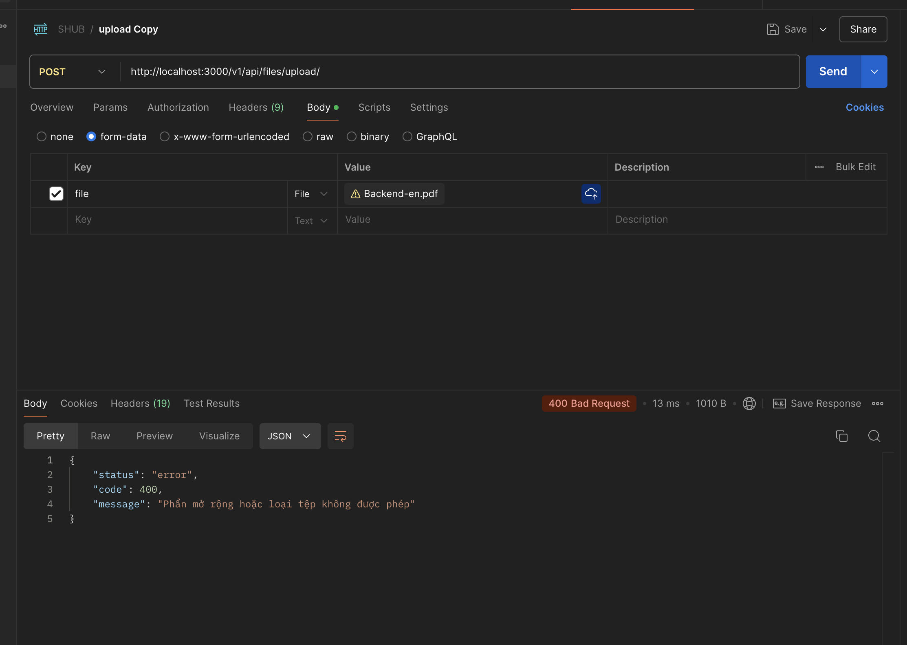
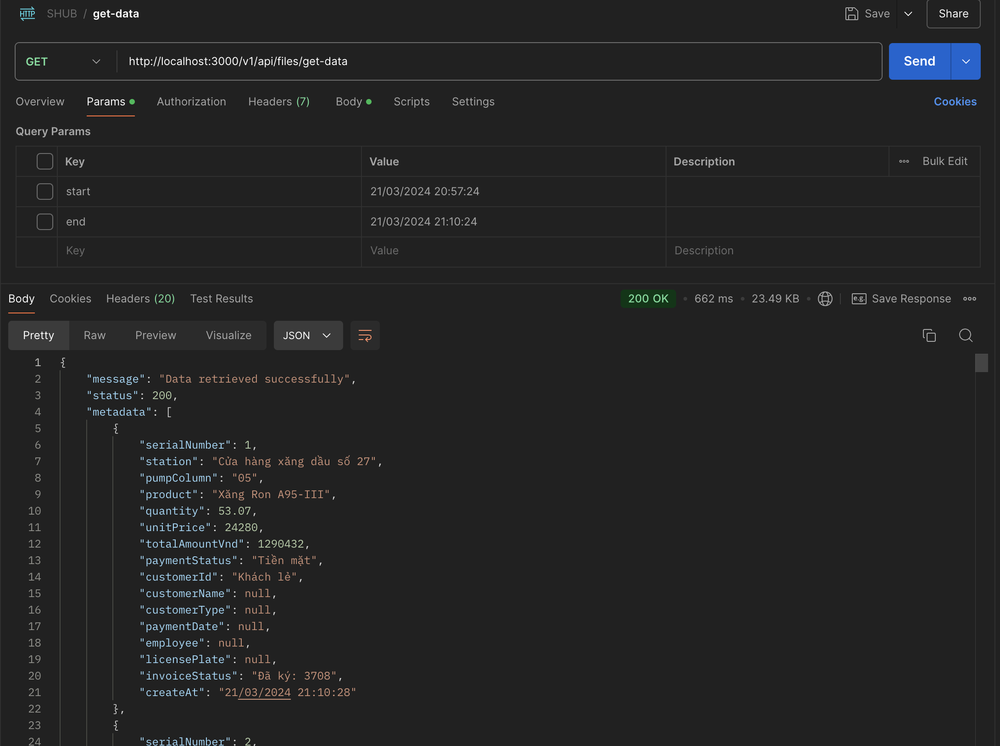
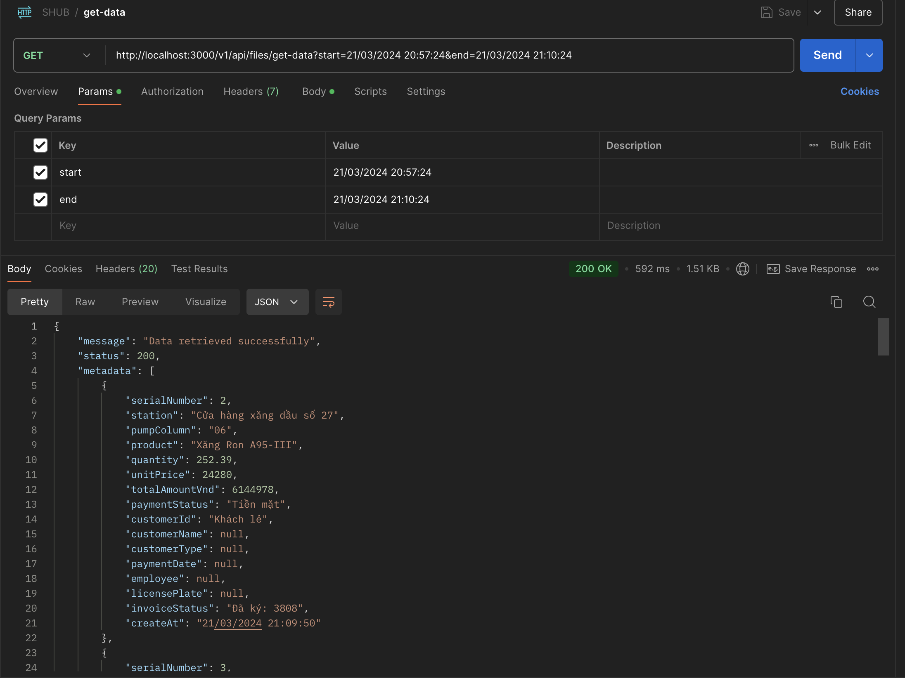
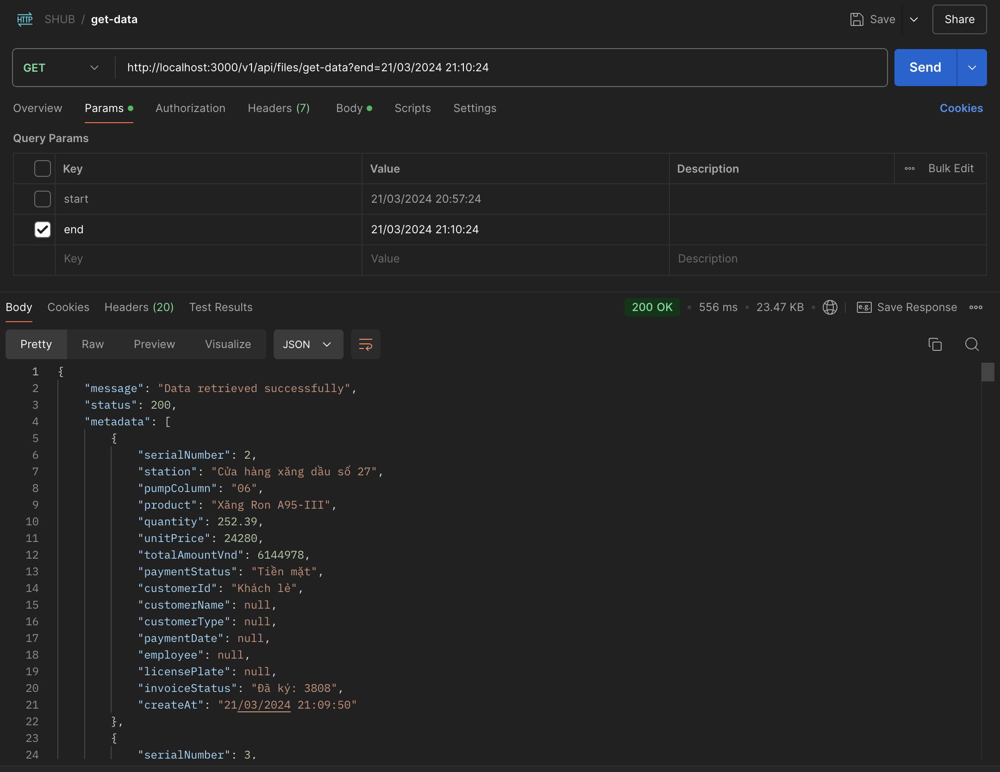

<!-- tutorial -->
# SHUB TEST


Đầy là câu trả lời chi SHUB TEST được xây dựng trên TypeScript, Express, TypeORM, và SQLite in-memory database

# TASK 1

## Chuẩn bị

- Node.js, Typescript
- Yarn package manager

## Cài đặt

1. Clone bài test sử dụng git

```bash
git clone https://github.com/weii1501/SHUB-test.git
```

2. Di chuyển vào thư mục task1
```bash
cd SHUB-test/task1
```

3. cài đặt các dep**end**encies
```bash
yarn install
```

## Environment Variables
Ứng dụng đang sử dụng phụ thuộc vào các biến môi trường (file .env):
- PORT: chỉ định port mà server sẽ sử dụng (mặc định là 3000)
- NODE_ENV: đó là một biến môi trường chỉ định cho "Node Environment"
```env
PORT=3000
NODE_ENV=dev
```

## Running the Application
1. Chạy ứng dụng
```bash
yarn start
```
2. chạy ứng dụng với môi trường dev
```bash
yarn dev
```

<!-- ## Running Tests
1. Run the tests using Jest
```bash
yarn test
```
2. Run the tests using Postman
- You can use the TodoList.postman_collection.json file to import into Postman for testing. -->


<!-- ## How to Run the Application with Docker
1. Build and run the Docker container
- Use Docker Compose to build and run the application:
```bash 
docker-compose up --build
```

2. Access the application
- Once the container is successfully **start**ed, open your browser and navigate to:
```bash
http://localhost:7979
```

3. Stop the application
- To stop the container, press `Ctrl + C` in the terminal where Docker Compose is running, or use the following command:
```bash
docker-compose down
``` -->

<!-- 4. File Structure
- `Dockerfile`: Defines how to build the Docker image for the application.
- `docker-compose.yml`: Defines the Docker services and how they interact.
- `.dockerignore`: Lists the files and directories to be ignored when building the Docker image. -->

## DEMO
### Yêu cầu 1: 
Upload file: client upload .xlsx file:
- Api: Upload file: client upload .xlsx file
- Trường hợp 1: khi client gửi request thành công

- Trường hợp 2: khi client gửi request không đính kèm file

- Trường hợp 3: khi client gửi request sai định dạnh file


### Yêu cầu 2: 

Truy vấn: Client truyền (giờ bắt đầu) - (giờ kết thúc) và trả về kết quả dựa theo file gần nhất người dùng upload:

- Api: http://localhost:3000/v1/api/files/
- các query trong api (định dạng 'dd/MM/yyyy HH:mm:ss'): **start** và **end**
- Trường hợp 1: Không có **start** và **end** -> lấy về tất cả dữ liệu trong file report

- Trường hợp 2: có **start** và **end** -> lấy về tất cả dữ liệu trong file report bắt đầu bằng **start** và kết thúc bằng **end**

- Trường hợp 3: chỉ có **start** -> lấy về tất cả dữ liệu trong file report sau **start**

- Trường hợp 4: chỉ có **end** -> lấy về tất cả dữ liệu trong file report trước **end**

- Trường hợp 5: khi **start** và **end** gửi để api không đúng định dạng


# TASK 2
Ở trong task này, tôi sử dụng Postgresql để thiết kế cơ sở dữ liệu.
### Thực thể (Entities):

1. **Trạm xăng**
   - `StationID` (Khóa chính)
   - Tên trạm (`Name`)
   - Địa chỉ (`Address`)
   - Thành phố (`City`)
   - Tỉnh/Thành (`State`)
   - Mã bưu điện (`ZipCode`)
   - Số liên lạc (`ContactNumber`)

2. **Hàng hoá**
   - `GoodsID` (Khóa chính)
   - Tên hàng hoá (`Name`)
   - Mô tả (`Description`)
   - Đơn vị tính (`Unit`)
   - Giá hiện tại (`CurrentPrice`)

3. **Trụ bơm**
   - `PumpID` (Khóa chính)
   - `StationID` (Khóa ngoại tham chiếu đến Trạm xăng)
   - `GoodsID` (Khóa ngoại tham chiếu đến Hàng hoá)
   - Số hiệu trụ bơm (`PumpNumber`)
   - Trạng thái (`Status`)

4. **Giao dịch**
   - `TransactionID` (Khóa chính)
   - Ngày giờ (`DateTime`)
   - `PumpID` (Khóa ngoại tham chiếu đến Trụ bơm)
   - Số lượng (`Quantity`)
   - Đơn giá (`UnitPrice`)
   - Giá trị giao dịch (`TotalValue`)

### Mối quan hệ (Relationships):

- Mỗi **Trạm xăng** có thể có nhiều **Trụ bơm** (1 - n).
- Mỗi **Hàng hoá** có thể được phân phối bởi nhiều **Trụ bơm** (1 - n).
- Mỗi **Trụ bơm** liên kết với một **Trạm xăng** và một **Hàng hoá**.
- Mỗi **Trụ bơm** có thể có nhiều **Giao dịch** (1 - n).
- **Giao dịch** liên kết với **Trụ bơm**, từ đó liên kết đến **Trạm xăng** và **Hàng hoá** tương ứng.


### Sơ đồ ER (Entity Relationship Diagram) mô tả các bảng và mối quan hệ giữa chúng:

### Toàn bộ các lệnh SQL cho thiết kế cơ sở dữ liệu:
***Đường dẫn***: task2/create_database.sql

# TASK 3
Ở task này tôi sử dụng Nodejs, axios để tiến hành GET và POST dữ liệu từ api cho trước. 
## Chuẩn bị

- Node.js, Typescript
- Yarn hoặc npm

## Cài đặt và khởi chạy

- Từ thư mục gốc, di chuyển vào thư mục ***task3***:
    ```bash
    cd task3
    ```
- Dùng  ***yarn*** hoặc ***npm*** để cài đặt các gói thư viện:
    ```bash
    yarn
    ```
    hoặc:
    ```bash
    npm install
    ```
- Dùng  ***yarn*** hoặc ***npm*** để khởi chạy chương trình:
    ```bash
    yarn start
    ```
    hoặc:
    ```bash
    npm run start
    ```
- Kết quả khi chạy chương trình:


